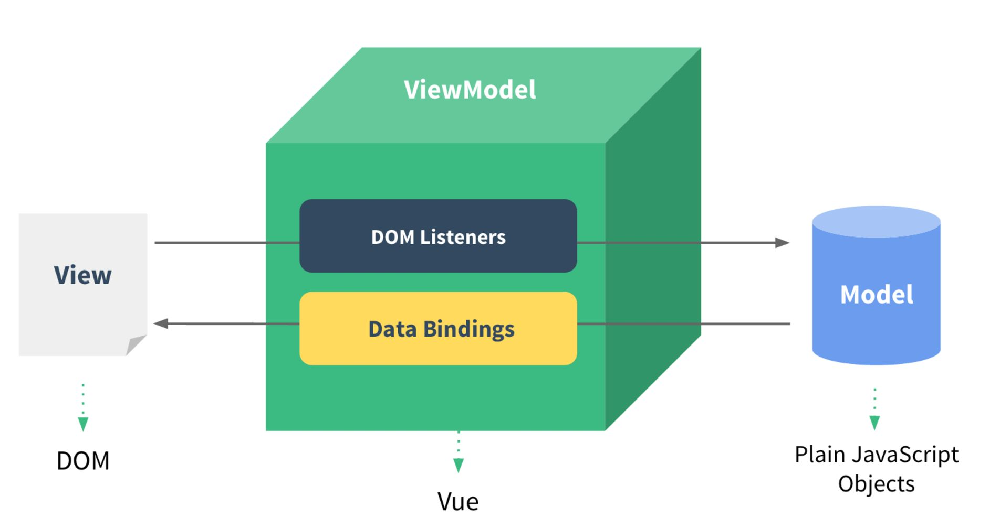
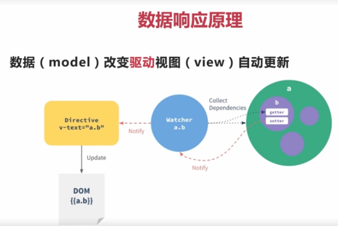
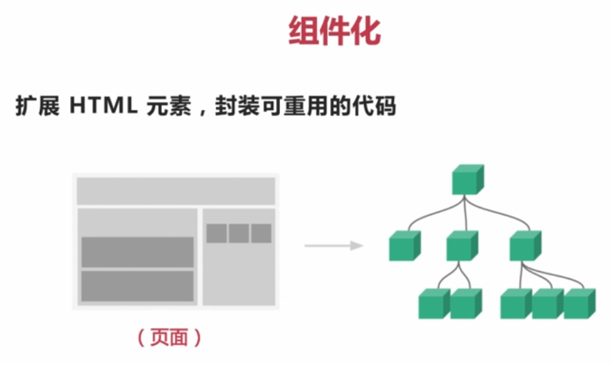
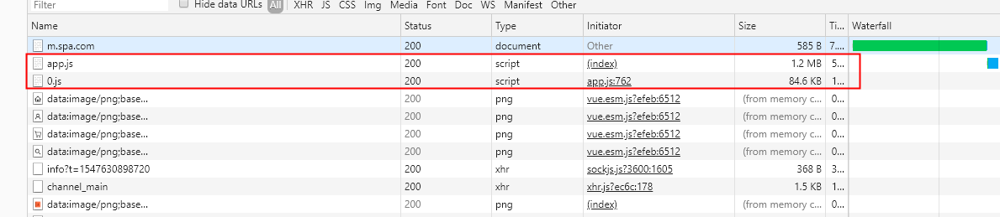

# Vue

## 前段开发趋势

- 旧浏览器逐渐淘汰，移动端需求增加
  - IE6-8 ---不支持---> ES5特性
  - IE9+, Chrome, Safari, Firefox 支持 ES5特性
- 前段**交互**越来越多，**功能**越来越复杂
  - 新闻趣味站
  - 在线购物平台
  - 金融信贷应用
  - 社交网络
  - 打车出行平台
  - 视频分享平台
  - 音乐互动社区
- 架构从传统后台MVC向 *REST Api + 前段MV*迁移**
  - MV*
    - MVC
    - MVP
    - MVVM(Angular.js/React.js/Vue.js)
      - View(视图，DOM) <---> ViewModel(中间件通信，观察者) <----> Model(数据，JavaScript对象)
      - 应用场景
        - 针对具有**复杂交互**逻辑的前段应用
        - 提供基础的**架构抽象**
        - 通过**Ajax数据持久化**，保证前段用户体验

## 技术选项

- 社区活跃度
- 对比其他技术
  - 容量
  - 学习难度

## 前段框架与库的区别？

- jQuery -> DOM 操作 + 请求
- art-template 库 -> 模板引擎
- 框架 = 全方位的功能
  - 简易的DOM体验+发请求+模板引擎+路由功能
  - 距离：KFC的世界里库就是一个小**套餐**，框架就是**全家桶**
- 代码上的不同
  - 使用库的代码：是调用某个函数，自己把控库的代码
  - 使用框架，其框架在帮我们运行我们编写的代码
    - 1.初始化自身的一些行为
    - 2.执行你说编写的代码
    - 3.释放一些资源

## Vue介绍

> 2014年, 一套用于构建**用户界面**的渐进式框架。Vue 的核心库只关注视图层，不仅易于上手，还便于与第三方库或既有项目整合。另一方面，当与现代化的工具链以及各种支持类库结合使用时，Vue 也完全能够为复杂的单页应用提供驱动

- 相继推出第三方库 **vue-router和vue-resource**
- 轻量级MVVM框架
- 数据驱动+组件化的前段开发



Vue只需要改变数据，Vue的**Directives指令**是**DOM进行封装**，当数据变化，Directives指令负责修改响应的DOM。数据驱动DOM变化，DOM是数据的一种自然映射。Vue修改视图的时候，DOM Listeners监听变化，他会改变数据，形成了数据双向绑定。





- 组件设计原则
  - 页面上每个独立的可视/可交互区域视为一个组件
  - 每个组件对应一个工程目录，组件所需要的各种资源在这个目录下就近维护


[Vue的render函数](https://www.w3cplus.com/vue/vue-render-function.html?utm_source=tuicool&utm_medium=referral)

## 安装vue

``` sh
# mkdir demo01
# cd demo01
# bower init
# bower install
# bower install vue vue-router
```

## Vue的文件介绍

- dist/vue.js (所有能支持的模块：支持adm/comonjs/es6/umd(通用模块机制))
  - 支持所有模块，vue.min.js是压缩后的，初学引入vue.js有提示
- dist/vue.common.js (CommonJS模块化代码)
- dist/vue.esm.js (ES6模块化代码)
  - dist/vue.esm.browser.js (基于浏览器的ES6模块化代码)
- dist/vue.min.js (压缩后的代码)
- dist/vue.runtime.js (运行时，和vue.js要小30%, 少模板编译器，阉割版)

- 开发环境：vue.runtime.esm.js
- 生产环境：vue.runtime.min.js

runtime与没有runtime区别？是不是可以写template, runtime不能写template。默认是runtime

## 插值表达式

- {{ expression }}
  - 对象： {不要连续3个{{ {name:'jack'} }}}
  - 字符串：{{ 'string' }}
  - 判断后的布尔值: {{ true }}
  - 三元表达式: {{ true?'ok':'err'}}
- 可以用于页面中简单粗暴的表达式
- 注意：必须在 data 这个函数中返回的对象中声明

## 指令

- 在 Vue 中提供了一些对于**页面+数据**的更为方便的**操作**，这些操作就是指令
  - 类似于HTML页面中的属性 `<div v-xxx></div>`
- `v-xx`开头的就叫做指令
- 指令中**封装了DOM行为**，结合属性作为一个暗号，暗号有对应的值，根据不同的值，框架会进行相关DOM操作的绑定

### 常用指令

- `v-text` 元素的 `innerText`属性必须是双标签
- `v-html` `元素的 innerHTML`
- `v-if` 判断是否**插入或移除**这个元素
- `v-else-if`
- `v-else`
- `v-show` **显示/隐藏元素**，如果确定要隐藏，会给元素的style加上 `display:none`
- `v-bind` 属性绑定
  - 给元素的属性赋值 `<div file="{{ varible }}"></div>`
    - 可以给已经存在的属性赋值 input value
    - 可以给自定义属性赋值 mydata
  - 语法在元素上 `v-bind:属性名="常量||变量名"`
  - 简写形式：`:属性名="变量名"`
- `v-on` 事件绑定
  - 自定义原生事件的给按钮添加 click 并让使用变量的样式改变
  - 普通刑事：`v-on:原生事件名="表达式||函数名"`
  - 简写形式：`@原生事件名="表达式"`

- **v-bind** 可以给任何属性赋值，是从Vue到页面的单项数据流
- **v-model** 只能给具备value属性的元素进行双向数据绑定（**必须使用value属性的元素**）
- `v-for="(item,index) in arr" :class="index"`
- 数组：item,index
- 对象：value,key,index

### 事件修饰符

```html
<!--第一种情况-->
<div @click="divEven" style="border:1px #188eee solid;">
  <a href="www.wovert.com" @click="aEven">链接</a>
</div>
<!--stop的使用：阻止事件冒泡的发生-->
<div @click="divEven" style="border:1px #188eee solid;">
  <a href="www.wovert.com" @click.stop="aEven">链接</a>
</div>

<!--prevent的使用：阻止默认事件的发生-->
<div @click="divEven" style="border:1px #188eee solid;">
  <a href="www.wovert.com" @click.stop.prevent="aEven">链接</a>
</div>

<!--self的使用：只有点击他本身时才去执行，点击他的子元素不去执行-->
<div @click.self="divEven" style="border:1px #188eee solid;">
  <a href="www.wovert.com" @click.prevent="aEven">链接</a>
</div>

<!--capture的使用：触发捕获事件()先执行大盒子的事件，起执行小盒子的事件-->
<div @click.capture="divEven" style="border:1px #188eee solid;">
  <a href="www.wovert.com" @click.prevent="aEven">链接</a>
</div>
<script>
new Vue({
  el:"#demo",
  methods:{
    divEven(){
      alert("我是div的事件");
    },
    aEven(){
      alert("我是a链接事件");
    }
  }
});
</script>
```

## 组件渲染

### 父子组件传值（父传子）

1. 父用子的时候通过属性传值
2. 子要声明 `props:['属性名']` 来接受
3. 收到后在`template`或js的`this.属性名` 直接使用
4. 常量传递直接用，变量传递加冒号
5. 父用子，先有子，声明子，使用子
6. 父传子，父传子(属性)， 子声明(收)，子直接用(就是自己的一样)

### 注册全局组件

> 应用场景：多次使用的公共性功能的组件，就可以注册成全局组件，减少冗余代码

- 全局API: `Vue.component('组件名', 组件对象)`

``` js
// 注册公共全局组件，省去compnents: {xxx:xx}
Vue.component('my-btn', {
  template: `
    <button style="background:red;color:white">按钮</button>
  `
});
```

## 附加功能：过滤器 & 监视改动

### 过滤器

- fiter 全局过滤器
  - `Vue.filter('过滤器', 过滤方式fn)`
- filters 组件自己的过滤器
  - `filters:{'过滤器', 过滤方式fn}`

- 将数据进行添油加醋的操作
- 过滤器分为两种
  - 1.组件内的过滤器（组价内有效）
  - 2.全局过滤器（所有组件共享）
- 先注册，后使用
- 组件内 filters: {过滤器名: 过滤器fn} 最终fn 内通过return 产出最终的数据
- 使用方式是 {{ 原有数据 | 过滤器名 }}
- 需求
  - 页面input框输入字符串，翻转字符串输出，按参数显示label(中英文)
- 过滤器fn
  - 声明 `function(data, argv1, argv2...) {}`
  - 使用 `{{ 数据 | 过滤器名(参数1,参数2) }}`

### 监视改动

- watch 监视单个
- computed 监视多个
  - `computed: {监视的业务名： function(){ return 显示一些内容}}`
  - 使用 `{{ 计算属性的名称 }}`
  - 包含原值不变，缓存不掉函数的优化机制

## slot

> 父组件传递的DOM结构, Vue提供的内置组件

- 就是子组件里给DOM留下的坑
- `<子组件>DOM</子组件>`
- slot动态的DOM、props是动态的数据

## 组件生命周期

- `beforeCreate()` 数据初始化之前，获取不到 data中的数据
- `created()` 可以操作数据并且可以实现vue->页面的影响
  - 事件函数，钩子函数
  - 应用：发起 `Ajax` 请求


## Vue 获取DOM元素

- `$属性`：$refs 获取组件内人元素
- `$parent`: 获取当前组件对象的父组件
- `$children`: 获取子组件
- `$root`: 获取 new Vue 的实例 vm
- `$el`: 组件对象的 DOM 元素

## 路由

### 路由原理

- 传统开发方式：URL改变后立刻发起请求，响应整个页面，渲染整个页面
- SPA 锚点值改变后不会发起请求，发起Ajax请求，局部改变页面数据
  - 页面不跳转 用户体验更好

### SPA

- Single Page Application(单页面应用程序)
- 前段路由
  - 锚点值监视
  - ajax 获取动态数据
  - 核心点事锚点值
- 前段框架：Vue/Angular/Reat 都适合开发单页应用

### vue-router 使用步骤

1. 引入
2. 安装插件
3. 创建路由实例
4. 配置路由规则
5. 将路由对象关联vue
6. 留坑

- router-link to="/xxx" 命名路由
  - 在路由规则对象中加入 name 属性
  - 在 router-link 中 :to="{ name:'xxx'}"

``` js
Vue.use(插件对象); // 过程中会注册一些全局组件及给vm或者组件对象挂在属性

// 给vm及组件对象挂在的方式
object.defineProperty(Vue.prototype, '$router', {
  get: function(){
    return 自己的router对象
  }
})
```

### vue-router 中的对象

- `$route` 路由信息对象，只读对象
- `$router` 路由操作对象，只写对象

- 嵌套路由

- 路由meta元数据 -> meta是对于路由规则是否需要验证权限的配置 (路由数据)
  - 路由对象中和name属性同级 `{ meta: {isChecked:true }}`
- 路由钩子 -> 权限控制的函数执行时期 (前段权限控制)
  - 每次路由匹配后，渲染组件到 router->view之前
  - `router.beforeEach(function(to, from, next) { })`

- 练习
  - 服务端：
    - /login ctx.body = {msg: 'ok'} 前段用jQ发送ajax请求
  - 客户端
    - 接受响应以后，如果OK，localStorage中保存改值
  - 在全局路由守卫中区分/login不验证(meta)，/show 要验证，验证条件就是localStorage中获取

- 编程导航
  - 跳到指定锚点并显示页面 `this.$router.push({ name:'xxx',query:{ id:1 }, params:{ name:'abc' } })`
  - 配置规则：`{ name: 'xxx', path: 'xxx/:name' }`
  - 根据历史记录，前进或后退
    - `this.$router.go(-1|1)` 1：进一步，-1：退一步

- 后端路由：url + 请求方式
- 前段路由：url(锚点值) + innerHTML

## axios

> 基于 http 客户端的 promise，面向浏览器和 NodeJS

- 浏览器端发起XMLHttpRequests请求
- Node发起http请求
- 支持Promise API
- 拦截请求和返回
- 转化请求和返回（数据）
- 取消请求
- 自动转化JSON数据
- 客户端支持低于XSRF（跨站请求伪造）

### setup axios

```sh
$ npm i axios
$ bower install axios
```

使用CDN

## 拦截器

> 比全局配置优先级更高

- 请求拦截器：在发起请求之前，做的处理
  - 案例：显示loadding图标, 请求头：附带 客户端cookie
- 响应拦截器：响应之后，做的处理
  - 案例：去掉loadding图标, 响应头：存储服务器的cookie
- 单请求配置 options: `axios.post(url, data, options)`
- 全局配置 defaults: this.$axios.defaults
- config: 请求拦截器中的参数
- response.config : 响应拦截器中的参数
- options:
  - baseURL 基础URL路径
  - params 查询字符串（对象）
  - transformRequest: function(post请求数据传递的数据) {} 转换请求体数据
  - transformResponse: function(re) { 自己转换相应回来的数据 } 转换响应体数据
  - headers 请求头信息
  - data 请求体数据
  - timeout 请求超时，请求多久以后没有响应算是超时（毫秒）

## vue-cli

> A simple CLI for scaffolding Vue.js projects.

- 目录结构
- 本地调试
- 代码部署
- 热加载
- 单元测试

[vue-cli](https://github.com/vuejs/vue-cli/tree/v2#vue-cli--)

### 全局安装 vue-cli

``` node
# npm install vue-cli -g
# vue -V
2.9.6
```

### Usage

``` node
# vue init <template-name> <project-name>
```

exmpale : `# vue init webpack my-project`

- template-name 模板名称
  - webpack: - A full-featured Webpack + vue-loader setup with hot reload, linting, testing & css extraction.
  - webpack-simple 缺少 hot reload, linting, testing & css extraction
  - browserify 基于浏览器完整版
  - browserify-simple 缺少hot-reload,linting & unit testing
  - pwa
  - simple - The simplest possible Vue setup in a single HTML file

### Custom Templates

`# vue init username/repo my-project`

### 项目构建实例1

1. 安装项目构建脚手架

``` node
# vue init webpack helloworld
# cd helloworld
# npm run dev
```

2. 浏览器输入 `http://localhost:8080`

``` node
dependecies: {
  "vue": "^2.0.1"
}
安装生产环境中的 Vue
# cnpm install --prduction
```

## vue-loader 搭建自己 webpack

1. [vuejs-templates/webpack](https://github.com/vuejs-templates/webpack) Fork到我的项目

2. 安装自定义模板

`# vim init wovert/webpack temp`

## webpack

### 历史介绍

- 2009年初，CommonJS 规范还未出来，此时前段开发人员编写的代码都是非模块化的。文件加载顺序所需带来的依赖问题

- NodeJS开启了JS全栈入门，而RequireJS在国外带动着前段逐步实现模块化
  - 国内seaJS大力推广
  - **AMD规范**，具体实现是 requrejs define('模块id', [模块依赖1,模块依赖2],function(){return;}) ajax请求文件并加载
  - **CommonJS** || CMD 规范 seajs淘伯
    - CommonJS 和CMD非常相似
      - CMD requrie/module.exports
    - CommonJS 是js在后端语言的规范：模块、文件操作、操作系统底层
    - CMD 模块定义
  - **UMD** 通用模块定义，一种既能兼容AMD也能兼容CommonJS也能兼容浏览器运行的万能代码
- **npm/bower** 集中包管理的方式备受青睐，12年的browserify/webpack 诞生
  - npm 是下载前段后端JS代码
  - **bower**只能下载前段的JS代码，bower在下载bootstrap的时候会自动的下载依赖库（下载jQuery）
  - **browserify** 解决让require可以运行在浏览器，分析require的关系，组装代码
  - webpack 打包工具，占市场主流

### UMD 规范

``` js
(function(root, factory){
  if (typeof exports === 'object') {
    module.exports = factory(); // commonjs环境下能拿到返回值
  } else if(typeof define === 'function') {
    define(factory);  // define(function(){return 'a'}) AMD
  } else {
    window.eventUtil = factory();
  }
})(this, function(){
  // module
  return {

    // 具体模块代码
    addEvent: function(el, type, handle) {
      // ...
    },
    removeEvent: function(el, type, handle) {
      // ...
    }
  }
})
```

### webpack 打包模块的源码

1. 把所有模块的代码放入到函数中，用一个数组保存起来
2. 根据require时传入的数组索引，能知道需要哪一段代码
3. 从数组中，根据索引取出包含我们代码的函数
4. 执行该函数，传入一个对象 module.exports
5. 我们的代码，按照约定，正好是用 module.exports = 'xxx' 进行赋值
6. 调用函数结束后，module.exports 从原来的空对象，就有值了
7. 最终 return module.exports; 作为require函数的返回值

### css 打包

```sh
css样式嵌入到html页面中（缺少style标签）
$ npm i css-loader -S

style标签模块
$ npm i style-loader -S

less转css
$ npm i less less-loader -S

```

### img 打包

```sh
$ npm i file-loader -S
$ npm i url-loader -S
```

### html

```sh
$ npm i html-webpack-plugin -S
```

## Error: Cannot find module 'webpack/lib/node/NodeTemplatePlugin'

是因为全局安装webpack导致的

`npm install webpack`

### webpack-dev-server

``` sh
$ npm i webpack-dev-server@2.9.0 -S
```

- --open 自动打开浏览器
- --hot 热更新，不在刷新的情况下替换，CSS样式
- --inline, 自动刷新
- --port 9999 指定端口
- --process 显示编译进度

### ES6浏览器下兼容

- babel-core: babel核心api的模块
  - babel.transform：用于字符串转码得到AST
- babel-loader 对接webapck
- babel-preset-env 预设和环境,包含ES6/ES7
  - 早起低版本：babel-preset-es6
  - 处理ES7：babel-preset-es2015
- babel-plugin-transform-runtime

``` sh
$ npm i babel-core babel-loader babel-preset-env babel-plugin-transform-runtime -S
```

`Module build failed: Error: Cannot find module '@babel/core'`

解决：
``` sh
$ npm uninstall babel-loader
$ npm install babel-loader@7.1.5 -S
```

### vue-loader

**webpacke@3.6.0 + vue-loader@14.1.1**

``` sh
$ npm info vue-loader versions
$ npm i vue@2 -S
$ npm i vue-loader@14.2.3 -S
$ npm i vue-template-compiler@2.5.16 -S 模板编译器
```

### 包的分类管理和分类回复

- 安装包的时候，做一个分类的管理
  - 开发依赖（打包相关的webpack）npm i package -D   => devDependencies
  - 生产依赖（不包含webapck打包依赖）npm i package -S => dependencies

- 恢复依赖
  - 如果包文件不小心珊了，少了
  - 开发恢复：`npm i` 对应 devDependencies
  - 生产恢复：`npm i --production` 对应dependencies

``` json

devDependencies

"babel-core": "^6.26.3",
"babel-loader": "^7.1.5",
"babel-plugin-transform-runtime": "^6.23.0",
"babel-preset-env": "^1.7.0",
"css-loader": "^2.1.0",
"file-loader": "^3.0.1",
"html-webpack-plugin": "^3.2.0",
"install": "^0.12.2",
"less": "^3.9.0",
"less-loader": "^4.1.0",
"style-loader": "^0.23.1",
"url-loader": "^1.1.2",
"webpack": "^3.5.0",
"webpack-dev-server": "^2.9.0"
```

### uglify 错误提示

ERROR in build.js from UglifyJs

Unexpected token: punc (() [build.js:1053,6]

``` .babelrc
{
  "presets": ["env"]
}
```

### ts

- webpack3
- typescript@3 ts-loader@3

``` ts.config.json
{
  "compilerOptions": {     // 编译选项
    "module": "commonjs",   // 包含 es6 module, es7 module 和 他自己
    "target": "es5",        // 编译成 es5
    "allowJs": true         // 允许使用 js
  },
 
  "include": [            // 编译路径
    "./src/*"
  ],
 
  "exclude": [            // 不包括路径
    "./node_modules"
  ]
}
```

### main.ts报错（ Cannot find module './App.vue'.）

- 原因： typescript不能识别.vue文件
- 解决办法： 引入vue的typescript declare库

## moment.js

``` sh
$ npm i moment -S
```

`headers: {'content-type': undefined}`

## 缩略图插件

``` sh
$ npm i vue-preview -S
```

## 父子组件内样式

- 父不管子
- 子管自己
- 全局都管
- 组件负责自己的样式，全局都可以控制

## json-server
4
> 模拟数据

``` sh
1. 安装包
# npm i -g json-server

2. 创建数据库
# vim db.json

3. 启动数据服务
# json-server --watch ./db.json

# json-server --host 192.168.1.2 --port 3004 --watch ./db.json

4. 修改接口
# vim Cart.vue

```

## EventBus

> 一个 new Vue

- $emit(xxx, 数据)
- $on('xxx', fn)
- $once('xxx', fn)
- $off('xxx')

## 路由守卫

1. 全局守卫(前)：前段的权限控制中 next() next(false)
2. 后置路由

- 路由独享
- 组件内的路由钩子函数
  - 1. 进入前，根据过来的路由做判断，让组件不同显示
    - next(vm => vm.xxx =123)
  - 2. 路由更新 (组件 created不会被调用)
    - 路由参数的改变触发：?id=xxx /xxx/:id
  - 3. 路由离开前(用户离开前的询问及保存)

- 内键组件
  - keep-alive 缓存频繁的创建和销毁的组件 => 停用与激活
  - transition 给元素或组件加过度效果 (js+css)
- 特殊函数
  - this.$nextTick(fn) 在 vue 生成DOM以后的DOM操作行为
    - 比如：当前 this.isExist = true 立刻操作这个元素不行
    - 而需要在$nextTick中，因为当前代码执行的时候元素还未存在
  - this.$set(obj,key,value) 手动通知vue数据响应式
  - this.$refs.xxx => ref="xxx"
    - 元素获取的就是元素对象
    - 组件后去的就是组件对象 xxx.$el 获取DOM对象

## transition

> Vue只有在插入，更新或者移除DOM元素时才会应用过渡效果，过渡效果的应用可以通过不同方式实现，官方文档中提到了如下几种：

1. 在CSS过渡和动画中自动应用class
2. 配合使用第三方的CSS动画库，如Animate.css
3. 在过渡钩子函数中使用JavaScript直接操作DOM
4. 配合使用第三方JavaScript动画库，如Velocity

上面四种方式其实主要就是两种，一个是利用CSS过渡或者动画，另一个是利用JavaScript钩子函数

### 怎么应用过渡到元素/组件上

要想使元素或者组件应用到我们所写的过渡动画，需要使用vue提供的transition来封装组件成为过渡组件，transition需要与如下情景中的任一种一起使用：

- v-if（条件渲染）
- v-show（条件展示）
- 动态组件
- 在组建的根节点上，并且被vue实例DOM方法触发，如appendTo方法把组件添加到某个根节点上

### 当需要插入或者删除封装成过渡元素的元素时，vue将做如下事情：

1. 查找目标元素是否有CSS过渡或者动画，如果有就在适当的时候进行处理
2. 如果过渡组件设置了JavaScript钩子函数，vue会在相应阶段调用钩子函数
3. 如果以上两者都没有，DOM操作（插入或者删除）就在下一帧立即执行

### CSS过渡

```js
<!-- 首先将要过渡的元素用transition包裹，并设置过渡的name，然后添加触发这个元素过渡的按钮（实际项目中不一定是按钮，任何能触发过渡组件的DOM操作的操作都可以） -->
<div>
  <button @click="show=!show">show</button>
  <transition name="fade">
    <p v-show="show">hello</p>
  </transition>
</div>
```

```css
/* 接着为过渡类名添加规则 */
&.fade-enter-active, &.fade-leave-active
  transition: all 0.5s ease
&.fade-enter, &.fade-leave-active
  opacity: 0
```

#### CSS过渡类名

> 组件过渡过程中，会有四个CSS类名进行切换，这四个类名与上面transition的name属性有关，比如name="fade"，会有如下四个CSS类名：

1. `fade-enter`：进入过渡的开始状态，元素被插入时生效，只应用一帧后立即删除
2. `fade-enter-active`：进入过渡的结束状态，元素被插入时就生效，在过渡过程完成之后移除
3. `fade-leave`：离开过渡的开始状态，元素被删除时触发，只应用一帧后立即删除
4. `fade-leave-active`：离开过渡的结束状态，元素被删除时生效，离开过渡完成之后被删除

从上面四个类名可以看出，`fade-enter-active`和`fade-leave-active`在整个进入或离开过程中都有效，所以CSS的transition属性在这两个类下进行设置。

上面示例中，`fade-enter`和`fade-leave-active`类设置CSS为`opacity:0`，说明过渡刚进入和离开的时候透明度为0，即不显示。当然还可以设置其他的CSS属性，transform属性是除了opacity之外经常在这里被用到的，transform用法可参考 http://www.w3cplus.com/content/css3-transition

- 显示第一帧
  - 添加 fade-enter
  - 添加 fade-enter-active
- 第二帧
  - 删除 fade-enter
  - 添加 fade-enter-to
- 最后一针
  - 删除 fade-enter-active
  - 删除 fade-enter-to

 - 隐藏时第一帧
  - 添加 fade-leave
  - 添加 fade-leave-active
- 第二帧
  - 删除 fade-leave
  - 添加 fade-leave-to
- 最后一针
  - 删除 fade-leave-active
  - 删除 fade-leave-to

点击按钮页面显示，第一帧`fade-enter`和`fade-enter-active`一起存在，内容元素隐藏状态`opacity: 0`；第二帧的时候`fade-enter`移除了，内容元素恢复了`opaicty: 1`, 这个时候`fade-enter-active`监听`opacity`变化，在`3s`中之内做过度动画(`0~1`)

**小技巧**：如果你只想设置组件过渡进入的效果而不想有组件过渡离开的效果，这时你就可以用钩子函数，只设置beforeEnter、enter、afterEnter这几个钩子函数就可以了

## Vue中使用 Animate.css 库

## 动态载入模板

注意：总容量不变

``` js
import Home from '@/components/Home/Home'
import Member from '@/components/Member/Member'
import Search from '@/components/Search/Search'
```

``` sh
# npm i --save-dev babel-plugin-syntax-dynamic-import
# vim .babel.rc
"plugins": ["syntax-dynamic-import"]
```



## vuex

> vue应用程序开发的状态管理模式。它采用集中式存储应用的所有组件的状态，并以相应的规则保证状态以一种可预测的方式发生变化。

- 状态自管理应用
  - state: 驱动应用数据源
  - view: 以声明方式将state 映射到视图
  - actions: 响应在 view 上的用户输入导致的状态变化

- 多个组件共享状态时，单项数据流的简洁性容易被破坏
  - 多个视图依赖于同一状态
    - 兄弟组件间的状态传递无能为力
  - 来自不同视图的行为需要变更同一状态
    - 父子组件直接引用或者通过事件来变更和同步状态的多分拷贝

因此，把组件的共享状态抽取出来，以一个全局单例模式管理

每一个 Vuex 应用的核心就是 store（仓库）。“store”基本上就是一个容器，它包含着你的应用中大部分的状态 (state)。Vuex 和单纯的全局对象有以下两点不同：

Vuex 的状态存储是响应式的。当 Vue 组件从 store 中读取状态的时候，若 store 中的状态发生变化，那么相应的组件也会相应地得到高效更新。

你不能直接改变 store 中的状态。改变 store 中的状态的唯一途径就是显式地提交 (commit) mutation。这样使得我们可以方便地跟踪每一个状态的变化，从而让我们能够实现一些工具帮助我们更好地了解我们的应用。

让我们来创建一个 store。创建过程直截了当——仅需要提供一个初始 state 对象和一些 mutation：

```js
import Vue from 'vue'
import Vuex from 'vuex'

// 在模块化构建系统中，注册插件
Vue.use(Vuex)

// 创建一个 store
const store = new Vuex.Store({
  state: { // 状态对象
    count: 0
  },
  mutations: { // 转变对象
    increment (state) {
      state.count++
    }
  }
})
```

现在可以通过 `store.state` 来获取状态对象，以及通过 `store.commit` 方法触发状态变更

```js
store.commit('increment')
console.log(store.state.count) // -> 1
```

``` sh
# vue init webpack demo-vuex
# npm i vuex -S
```

## prerender-spa-lugin

```sh
1. 下载包
# npm i prerender-spa-plugin -D --ignore-scripts

2. 配置build/webpack.prod.js文件
# vim webpack.prod.js
const PrerenderSpaPlugin = require('prerender-spa-plugin')
plugins: [
  new PrerenderSpaPlugin({
    staticDir: path.join(__dirname, '..', 'dist'),
    // required - Routes to render.
    routes: ['/', '/user'] // 根据这两个路由规则找组件渲染HTML文件
  })
]

3. 配置路由变更对象，传递构造属性
mode: 'history'

4. 构建项目代码：
# npm run build

5. 进入dist目录，启动生成代码
# hs -o -p 9999


```

### prerender-spa-plugin中有puppeteer 可能会报错

ERROR: Failed to download Chromium r515411! Set "PUPPETEER_SKIP_CHROMIUM_DOWNLOA
D" env variable to skip download.

此时可以试试淘宝镜像安装 `cnpm install --save prerender-spa-plugin`

因为在执行安装的过程中需要执行install.js，这里会下载Chromium,官网建议是进行跳过，我们可以执行 —ignore-scripts 忽略这个js执行。也可以通过设置环境变量set PUPPETEER_SKIP_CHROMIUM_DOWNLOAD=1阻止下载 Chromium （因为封网，直接下载会失败）
`npm i --save puppeteer --ignore-scripts`

然后手动下载Chromium
解压到你当前项目中的node_modules/puppeteer/.local-chromium/mac-571375下就可以了

[vue 解决seo优化之预渲染prerender-spa-plugin](https://www.jianshu.com/p/8f82459895c9)

## vue-meta-info

``` sh
# cnpm i vue-meta-info -D
```

## 骨架屏(Sekeleton)

``` sh
# cnpm i lavas -g
# lavas init
# 选择包含app_shell 页包含了骨架屏的功能
```

- 骨架屏代替loading图标，用户体验更好，可以体检预览结构
- 配置PWA中的service worker 就可以缓存各种数据，不必请求多余的资源（包括骨架屏）
- service worker 可以实现离线浏览（所有资源缓存在起哄，拦截浏览器请求，相应保存的结果）

## history

`history.pushState({}, '', url)` // 判断后做相应url改变

## webpack插件实现骨架屏

- 首次加载慢
  - 首屏白屏（量太大，渲染好久）
  - 首屏卡顿（加载一半，一半卡住）
- 解决方案：
  - 1. 客户端太慢，渲染容易卡住。服务端渲染好页面，客户端就加载HTML
  - 2. 白屏时，显示骨架屏

## pwa

``` sh
# vue init pwa demo-pwa
```

## vue-resource

> Vue Ajax 通信

``` sh
# cnpm i vue-resource -S
```

## Webpack 构建工具

## eslint

- es6 + eslint 代码风格价差工具

## vue-cli脚手架搭建的项目可以处理vue文件中postcss语法

- CSS预处理器
  - Less
  - Sass
  - Stylus

CSS预处理器根据它的**规则格式转成css**的东西

- 语法不够强大，不能够嵌套书写，不利于模块化开发
- 没有变量和逻辑上的复用机制，导致在css的属性值中只能使用字面量形式，以及不断重复书写重复的样式，导致难以维护

- css预处理器给出了非常可行的解决方案
  - 变量
    - Sass：使用`$`对变量进行声明，**变量名和变量值使用冒号进行分割**
    - Less：使用`@`对变量进行声明
    - Stylus：中声明变量没有任何限定，结尾的**分号可有可无**，但**变量名和变量值之间必须要有『等号』**。但需要注意的是，如果用“@”符号来声明变量，Stylus会进行编译，但不会赋值给变量。就是说，Stylus 不要使用 `@`声明变量。Stylus 调用变量的方法和Less、Sass完全相同。  
  - 作用域
    - Sass：它的方式是三者中最差的，不存在全局变量的概念
    - Less：它的方式和js比较相似，逐级往上查找变量
    - Stylus：它的方式和Less比较相似，但是它和Sass一样更倾向于指令式查找  
  - 嵌套
    - 三者在这处的处理都是一样的，使用`&`表示父元素

可以在保证DPY、可维护性、灵活性的前提下，编写css样式

之所以会出现向预处理器这样子的解决方案，归根结底还是css标准发展的滞后性导致的。同时，我们也应该考虑一下，真的只要预处理器就够了吗？往往在项目过大时，由于**缺乏模块**的概念，全局变量的问题会持续困扰着你。每次定义选择器时，总是要顾及到其他文件中是否也使用了同样的命名。毕竟项目是团队的，而不是个人的。哪是否有方式可以解决这些问题呢？

### 前人的方法

对于css命名冲突的问题，由来已久，可以说我们前端开发人员，天天在苦思冥想，如何去优雅的解决这些问题。css并未像js一样出现了AMD、CMD和ES6 Module的模块化方案。

那么，回到问题，如何去解决呢？我们的前人也有提出过不同的方案：

1. Object-Oriented CSS
2. BEM
3. SMACSS

方案可以说是层出不穷，不乏有团队内部的解决方案。但是大多数都是一个共同点——为**选择器增加前缀**。

这可是一个**体力活**，你可能需要手动的去编写长长的选择器，或许你可以使用预编译的css语言。但是，它们似乎并为解决本质的问题——为何会造成这种缺憾。我们不妨来看看，使用BEM规范写出来的例子：

``` css
<!-- 正确的。元素都位于 'search-form' 模块内 -->
<!-- 'search-form' 模块 -->
<form class="search-form">
    <!-- 在 'search-form' 模块内的 'input' 元素 -->
    <input class="search-form__input" />
    <!-- 在 'search-form' 模块内的 'button' 元素 -->
    <button class="search-form__button"></button>
</form>

<!-- 不正确的。元素位于 'search-form' 模块的上下文之外 -->
<!-- 'search-form' 模块 -->
<form class=""search-block>
</form>

<!-- 在 'search-form' 模块内的 'input' 元素 -->
<input class="search-form__input"/>

<!-- 在 'search-form' 模块内的 'button' 元素 -->
<button class="search-form__button"></button>
```

### 一种希望

现在的网页开发，讲究的是**组件化的思想**，因此，急需要可行的css Module方式来完成网页组件的开发。自从2015年开始，国外就流行了**CSS-in-JS**(典型的代表，react的styled-components)，还有一种就是**CSS Module**。

对于css，大家都知道，它是一门描述类语言，并不存在动态性。那么，要如何去形成module呢。我们可以先来看一个react使用postcss的例子：

``` css
//example.css

.article {
    font-size: 14px;
}
.title {
    font-size: 20px;
}
```

之后，将这些命名打乱：

``` css
.zxcvb{
    font-size: 14px;
}
.zxcva{
    font-size: 20px;
}
```

将之命名对应的内容，放入到JSON文件中去：

``` json
{
    "article": "zxcvb",
    "title": "zxcva"
}
```

之后，在js文件中运用：

``` js
import style from 'style.json';

class Example extends Component {
  render() {
    return (
      <div classname={style.article}>
        <div classname={style.title}></div>
      </div>
    )
  }
}
```

这样子，就描绘出了一副**css module的原型**。当然，我们不可能每次都需要手动去写这些东西。我们需要**自动化的插件**帮助我们完成这一个过程。之后，我们应该先来了解一下**postCSS**。

### postcss

> 根据 can i use(http://caniuse.com) 官网去写代码

PostCSS是预处理器、或者后处理器？。其实，它什么都不是。它可以理解为一种**插件系统**。使用它GitHub主页上的介绍：

> PostCSS is a tool for transforming CSS with JS plugins. These plugins can support variables and mixins, transpile future CSS syntax, inline images, and more.

你可以在使用预处理器的情况下使用它，也可以在原生的css中使用它。它都是支持的，并且它具备着一个庞大的生态系统，例如你可能常用的`Autoprefixer`，就是PostCSS的一个非常受欢迎的插件，被Google, Shopify, Twitter, Bootstrap和CodePen等公司广泛使用。

当然，我们也可以在**CodePen**中使用它：

[PostCSS Deep Dive](https://webdesign.tutsplus.com/series/postcss-deep-dive--cms-889)

接下来，我们来看一下PostCSS的配置：`webpack+postcss+postcss-loader+cssnext+postcss-import`

首先，我们可以通过yarn来安装这些包：

`yarn add --dev webpack extract-text-webpack-plugin css-loader file-loader postcss postcss-loader postcss-cssnext postcss-import`

然后，我们配置一下`webpack.config.js`：

``` js
const webpack = require('webpack');
const path = require('path');
const ExtractTextPlugin = require('extract-text-webpack-plugin');
module.exports = {
  context: path.resolve(__dirname, 'src'),
  entry: {
    app: './app.js';
  },
  module: {
    loaders: [
      {
        test: /\.css$/,
        use: ExtractTextPlugin.extract({
          use: [
            {
              loader: 'css-loader',
              options: { importLoaders: 1 },
            },
            'postcss-loader',
          ],
        }),
      },
    ],
  },
  output: {
    path: path.resolve(__dirname, 'dist/assets'),
  },
  plugins: [
    new ExtractTextPlugin('[name].bundle.css'),
  ],
};
```

然后在根目录下配置`postcss.config.js`

``` js
module.exports = {
  plugins: {
    'postcss-import': {},
    'postcss-cssnext': {
      browsers: ['last 2 versions', '> 5%'],
    },
  },
};
```

之后，就可以在开发中使用`cssnext`的特性了

``` js
/* Shared */
@import "shared/colors.css";
@import "shared/typography.css";
/* Components */
@import "components/Article.css";
```

``` js
/* shared/colors.css */
:root {
  --color-black: rgb(0,0,0);
  --color-blue: #32c7ff;
}

/* shared/typography.css */
:root {
  --font-text: "FF DIN", sans-serif;
  --font-weight: 300;
  --line-height: 1.5;
}

/* components/Article.css */
.article {
  font-size: 14px;
  & a {
    color: var(--color-blue);
  }
  & p {
    color: var(--color-black);
    font-family: var(--font-text);
    font-weight: var(--font-weight);
    line-height: var(--line-height);
  }
  @media (width > 600px) {
    max-width: 30em;
  }
}
```

最后使用`webpack`进行编译就可以了。

https://github.com/laizimo/zimo-article

https://evilmartians.com/chronicles/postcss-modules-make-css-great-again


---------------


`&`属于postcss的语法，这样书写样式可以清楚的看出选择器之前的层级关系，非常好用。在利用vue-cli脚手架搭建的项目中如果不配置是不支持这种写法的，这样写不会报错，但是**样式不生效**。为了让项目中的vue文件支持这种写法，需要在配置`postcss-cssnext模块`

往项目中安装postcss-cssnext模块

`npm install postcss-cssnext --save-dev`

安装完后，会在项目的package.json文件的devDependencies对象中看到postcss-cssnext模块的信息：

在`build`文件夹下面的`vue-loader.config.js`文件中配置`postcss-cssnext`模块

``` js
const cssnext = require('postcss-cssnext')
module.exports = {
  postcss: [cssnext()],
  ...
```

《深入PostCSS Web设计》

### vue-cli 使用stylus

安装stylus以webpack模板为例，在webpack的loader配置中，已经做好了stylus的兼容，`build/utils.js`中已有对loader的配置，但默认**没有stylus包和loader包**，需要安装：

```sh
# cnpm i stylus stylus-loader -D

```

因为是预编译嘛，肯定不用-S了

内部 stylus

vue-cli脚手架搭建的项目中用的是.vue文件，文件里面有三个部分，模板（template）、脚本（script）、样式表（style）。

其中的style，声明一下是stylus类型：

`<style lang="stylus" rel="stylesheet/stylus"></style>`

外部stylus文件后缀为.styl，不是.css，这和sass、less一样，要不然怎么知道用的是stylus语法。

外部建好文件以后，.vue中引入：

`import 'color.styl'`

## swiper

[swiper demo](https://surmon-china.github.io/vue-awesome-swiper/)